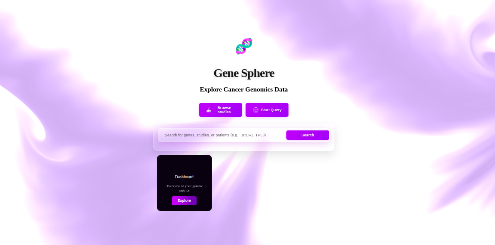

# GeneSphere — Frontend (THIS APP IS A WORK IN PROGRESS]

[](https://github.com/Lexaa19/GeneSphere-frontend)
[](#contributing)

> Frontend for GeneSphere — an interactive web application for exploring and visualizing genomic / gene-related data (focused on lungs).

## 🖼️ Preview

<div align="center">
  
  <p><em>GeneSphere's intuitive homepage with search functionality and interactive design</em></p>
</div>


## Table of Contents
- [Preview](#️-preview)
- [About](#about)
- [Features](#features)
- [Tech Stack](#tech-stack)
- [Getting Started](#getting-started)
  - [Prerequisites](#prerequisites)
  - [Installation](#installation)
  - [Running the App](#running-the-app)
- [Project Structure](#project-structure)
- [Contributing](#contributing)

---

## About
GeneSphere-frontend is the client-side application that provides an intuitive UI to explore lung genomic datasets, visualize gene networks, inspect variant annotations, and collaborate on findings. This repo contains the UI code, components, styling, assets and integration code to connect to backend APIs.

## Features
- 🔍 Search genes, variants, and datasets
- 📊 Interactive gene network visualizations
- 🫁 Specialized focus on lung genomic data
- 🔄 Real-time data synchronization with Spring Boot backend

## Tech Stack
- **Frontend framework**: React 18
- **Build tool**: Vite
- **Language**: JavaScript/JSX
- **Styling**: CSS
- **HTTP Client**: Axios / Fetch API
- **Charting / visualization**: TODO (Planned: D3.js, Recharts, or Cytoscape.js)
- **Backend**: Spring Boot REST API

## Getting Started

### Prerequisites
- Node.js >= 16.x
- npm >= 8.x (or yarn/pnpm)
- Running Spring Boot backend (see [API & Authentication](#api--authentication))

### Installation
1. Clone the repo:
   ```bash
   git clone https://github.com/Lexaa19/GeneSphere-frontend.git
   ```

2. Change into the project directory:
   ```bash
   cd GeneSphere-frontend
   ```

3. Install dependencies:
   ```bash
   npm ci
   ```


### Running the App (Development)
Start the development server:
```bash
npm run dev
```

The app will be available at `http://localhost:5173` (Vite default port).

> **Note**: Ensure your Spring Boot backend is running before starting the frontend to avoid API connection errors.

### Building for Production
Build the optimized production bundle:
```bash
npm run dev
```

Preview the production build locally:
```bash
npm run preview
```

## Project Structure

```
GeneSphere-frontend/
├── public/              # Static assets
├── src/
│   ├── assets/          # Images, icons, and static files
│   ├── components/      # Reusable React components
│   ├── pages/           # Page-level components
│   ├── services/        # API service layer (Axios/Fetch wrappers)
│   ├── hooks/           # Custom React hooks
│   ├── utils/           # Helper functions and utilities
│   ├── styles/          # Global CSS and theme files
│   ├── App.jsx          # Root component
│   └── main.jsx         # Application entry point
├── index.html           # HTML template
├── vite.config.js       # Vite configuration
├── package.json         # Dependencies and scripts
└── README.md            # This file
```

### Key Directories
- **`src/components/`**: Reusable UI components (buttons, cards, modals, gene visualizers)
- **`src/pages/`**: Route-level components (Home, GeneSearch, DatasetExplorer, etc.)
- **`src/services/`**: API client modules that communicate with Spring Boot endpoints
- **`src/hooks/`**: Custom hooks for data fetching, authentication state, etc.

## API & Authentication

### Backend Connection
GeneSphere-frontend connects to a **Spring Boot** REST API backend. The backend handles:
- Gene and variant data storage (PostgreSQL/MySQL)
- Complex genomic queries and filtering
- Authentication and authorization (Spring Security + JWT)
- File uploads and data processing

### Setting Up Spring Boot Integration
TODO

## Contributing
We welcome contributions!

### Contributor Checklist
- Fork the repository and create a feature branch (`feature/your-feature`)
- Ensure the Spring Boot backend is running for local testing
- Run linting and tests locally (when configured)
- Update or add tests for new functionality
- Open a pull request with:
  - Clear description of changes
  - Linked issue (if applicable)
  - Screenshots for UI changes

### Branching Strategy
- `main` — production-ready code
- `develop` — integration branch
- `feature/*` — new features
- `bugfix/*` — bug fixes


💡 For backend setup, see the Spring Boot repository documentation.
